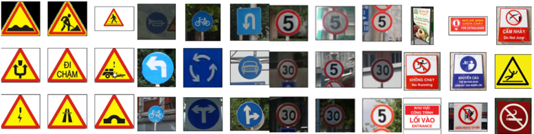

# CS231.O22 - Introduction to Computer Vision

## 🚦 Traffic Sign Classification

⛔️ In today's world, the development of self-driving cars is an undeniable trend. The task of classifying traffic signs plays a crucial role in advancing autonomous driving systems and assisting human drivers. These systems require accurate detection and classification of traffic signs to create a safer and more efficient traffic environment.

## 📑 Table of Contents
- [About Me](#about-me)
- [Introduction](#introduction)
- [Tech Stack](#tech-stack)
- [Data](#data)
- [Demo](#demo)

## About Me
👋 **Name:** Nguyễn Hoàng Phúc  
👋 **Role:** Leader  
👋 **MSSV:** 22521129  
👋 **Gmail:** 22521129@gm.uit.edu.vn

## Introduction
- **Course Name:** Introduction to Computer Vision
- **Course Code:** CS232
- **Class Code:** CS231.O22
- **Academic Year:** Semester 2 (2024 - 2025)
- **Lecturer:**
 
| No. | Full Name | Email |
| :-: | --------- | ----- |
| 1   | **TS. Mai Tiến Dũng** | *dungmt@uit.edu.vn* |

## Team Members
| No. | Full Name        | MSSV      | Email                     |
| :-: | ---------------- | --------- | ------------------------- |
| 1   | **Nguyễn Hoàng Phúc** | *22521129* | *22521129@gm.uit.edu.vn* |
| 2   | **Võ Nguyên Đăng**    | *22520197* | *22520197@gm.uit.edu.vn* |
| 3   | **Trần Vũ Nhật**      | *22521031* | *22521031@gm.uit.edu.vn* |

## Tech Stack


## Data
- **Danger Signs:** 150 images
- **Instruction Signs:** 150 images
- **Prohibition Signs:** 150 images
- **Other Signs (neg):** 150 images



## Demo
- This application utilizes the Streamlit library to build a simple user interface for traffic sign classification. Below is a demonstration of the application using three different classification algorithms: Decision Tree, KNeighborsClassifier, and SVM.

### Running the Streamlit App: 

```bash
streamlit run main.py
```


